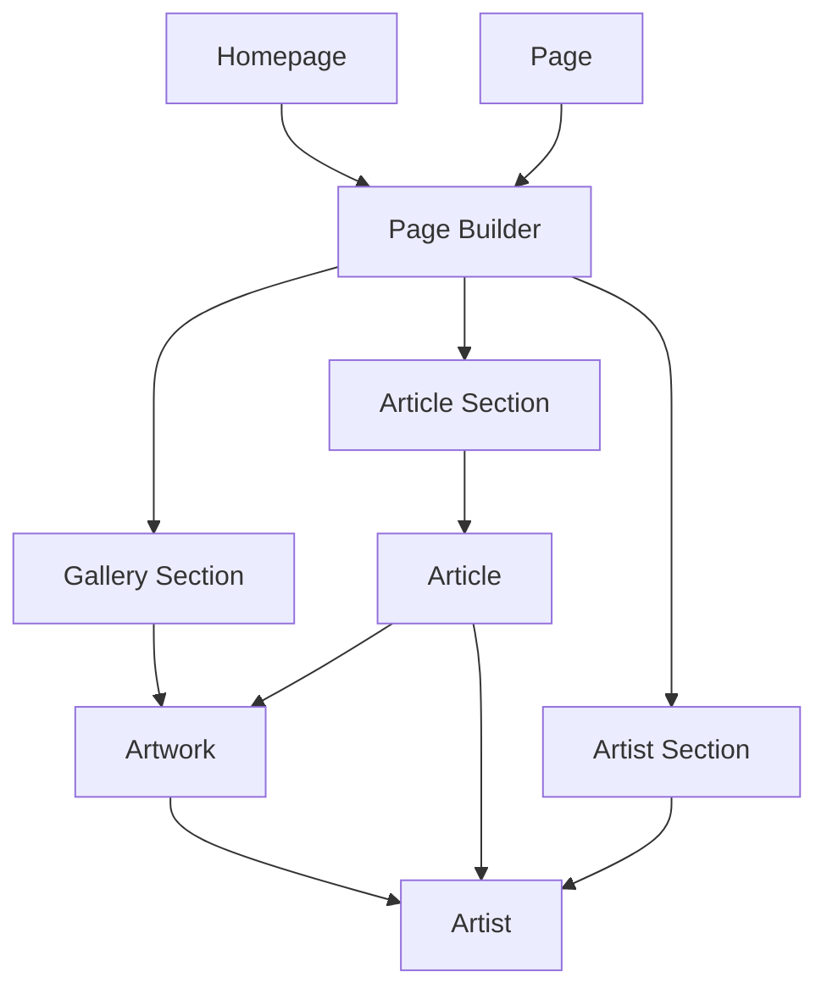

# 🔍 GLOBAL SANITY AUDIT REPORT
## End-to-End Analysis: Navigation Leak Detection

**Audit Date**: February 3, 2026  
**Project**: Ninart Vision  
**Scope**: All Sanity schemas, GROQ queries, frontend patterns, and content relationships  
**Objective**: Identify all Sanity-related causes of unintended navigation

---

## EXECUTIVE SUMMARY

### ✅ PRIMARY FINDING
**The project does NOT contain Shop or Support Project schemas.**

The mentioned redirects to "Shop" or "Support Project" pages are **external to this Sanity setup**. These pages are either:
1. Hardcoded routes in the frontend application
2. Part of a separate e-commerce/support system
3. Navigation menu items that overlay the gallery DOM

### 🔴 CONFIRMED RISK: Gallery Navigation Leak
**Root Cause**: Artwork `slug` fields are fetched in gallery queries and rendered as `<Link>` components, creating clickable navigation that interferes with modal behavior.

**Impact**: When users click gallery images, browser events can fall through to underlying link elements, causing unexpected navigation.

---

## 1. SCHEMA AUDIT

### 1.1 Document Schemas Overview

| Schema | Slug? | References | Navigation Fields | Gallery Context Risk |
|--------|-------|------------|-------------------|---------------------|
| **homepage** | ❌ No | pageBuilder sections | N/A | ✅ Safe |
| **page** | ✅ Yes | pageBuilder sections | slug | ⚠️ Not used in galleries |
| **siteSettings** | ❌ No | Navigation links | Internal/external links | ⚠️ Menu overlay risk |
| **artist** | ✅ Yes | None | slug | ⚠️ Can cause navigation |
| **artwork** | ✅ Yes | artist (reference) | slug | 🔴 **HIGH RISK** |
| **article** | ✅ Yes | artist/artwork refs | slug | ⚠️ Not in galleries |
| **slider** | ❌ No | None | slide links | ⚠️ Slide overlay risk |

### 1.2 Object Schemas Overview

| Schema | Navigation Fields | Gallery Risk | Notes |
|--------|-------------------|--------------|-------|
| **pageBuilder** | None | ✅ Safe | Container only |
| **heroSection** | CTA internal/external links | ✅ Safe | Separate from gallery |
| **gallerySection** | ❌ None | 🔴 **CRITICAL** | Renders artworks with slugs |
| **artistSection** | ❌ None | ⚠️ Medium | Renders artists with slugs |
| **articleSection** | ❌ None | ✅ Safe | Uses article slugs correctly |
| **textSection** | Portable text links | ⚠️ Medium | Rich text can contain links |
| **sliderSection** | Slide links | ⚠️ Medium | Overlays can interfere |
| **sliderReference** | Via slider | ⚠️ Medium | Inherits slide risks |
| **portableTextBlock** | Internal/external links | ⚠️ Medium | Embedded links |
| **slide** | Optional link object | ⚠️ Medium | Can create overlays |

---

## 2. NAVIGATION FIELD ANALYSIS

### 2.1 Slug Fields (Direct Navigation Enablers)

**Location**: All slugs are required and auto-generated from title/name

#### artwork.ts
```typescript
defineField({
  name: 'slug',
  title: 'Slug',
  type: 'slug',
  options: {
    source: 'title',
    maxLength: 96,
  },
  validation: (Rule) => Rule.required(), // ⚠️ REQUIRED
})
```

**Risk**: ✅ **Schema is correct** - slugs needed for detail pages  
**Problem**: ❌ **Query usage** - slugs fetched in gallery contexts

#### artist.ts
```typescript
defineField({
  name: 'slug',
  title: 'Slug',
  type: 'slug',
  options: {
    source: 'name',
    maxLength: 96,
  },
  validation: (Rule) => Rule.required(), // ⚠️ REQUIRED
})
```

**Risk**: ⚠️ Medium - if artist sections use `<Link>` wrappers

### 2.2 Reference Fields (Indirect Navigation)

#### artwork → artist (Reference)
```typescript
defineField({
  name: 'artist',
  title: 'Artist',
  type: 'reference',
  to: [{type: 'artist'}],
  validation: (Rule) => Rule.required(),
})
```

**Risk**: ⚠️ Medium - if dereferenced artist includes slug in queries

#### article → artists/artworks (References)
```typescript
defineField({
  name: 'relatedArtists',
  title: 'Related Artists',
  type: 'array',
  of: [{type: 'reference', to: [{type: 'artist'}]}],
})
```

**Risk**: ✅ Low - article context separate from galleries

### 2.3 Internal Link Objects (Direct Navigation)

#### heroSection CTA
```typescript
defineField({
  name: 'internalLink',
  title: 'Internal Link',
  type: 'reference',
  to: [{type: 'page'}, {type: 'artist'}, {type: 'artwork'}],
  // ...
})
```

**Risk**: ✅ Safe - hero CTAs are intentional navigation
**Isolation**: ✅ Separate from gallery context

#### slide Link
```typescript
defineField({
  name: 'link',
  title: 'Link (Optional)',
  type: 'object',
  fields: [
    // linkType: internal/external/none
    // internalLink: reference to page/artist/artwork
  ]
})
```

**Risk**: ⚠️ **MEDIUM-HIGH** - slides can overlay galleries
**Problem**: Slider navigation could interfere with gallery clicks

#### portableTextBlock Annotations
```typescript
{
  name: 'internalLink',
  type: 'object',
  title: 'Internal Link',
  fields: [
    {
      name: 'reference',
      type: 'reference',
      to: [{type: 'page'}, {type: 'article'}, {type: 'artist'}, {type: 'artwork'}],
    }
  ]
}
```

**Risk**: ⚠️ Medium - portable text can appear in textSections
**Problem**: If textSection overlays gallery, links can interfere

### 2.4 External URL Fields

Found in:
- `heroSection.cta.externalUrl`
- `slide.link.externalUrl`
- `portableTextBlock.link.href`
- `siteSettings.mainNavigation.externalUrl`

**Risk**: ✅ Low - external URLs are intentional navigation
**Isolation**: Generally separate from gallery contexts

---

## 3. GROQ QUERY AUDIT

### 3.1 Current Query Patterns (from ARCHITECTURE.md)

#### 🔴 CRITICAL ISSUE: Gallery Query with Slug

**File**: ARCHITECTURE.md, lines 52-85

```groq
_type == "gallerySection" => {
  ...,
  artworkSource == "manual" => {
    artworks[]->{
      _id,
      title,
      slug,        // 🔴 PROBLEM: Slug fetched
      image{ /* ... */ },
      artist->{name}
    }
  },
  artworkSource == "featured" => {
    "artworks": *[_type == "artwork" && featured == true]{
      _id,
      title,
      slug,        // 🔴 PROBLEM: Slug fetched
      image{ /* ... */ },
      artist->{name}
    }
  },
  artworkSource == "byArtist" => {
    "artworks": *[_type == "artwork" && artist._ref == ^.artist._ref]{
      _id,
      title,
      slug,        // 🔴 PROBLEM: Slug fetched
      image{ /* ... */ },
      artist->{name}
    }
  }
}
```

**Analysis**:
- ❌ Fetches `slug` field for artworks in gallery context
- ❌ Frontend can use slug to create navigation links
- ❌ When rendered as `<Link href={`/artworks/${slug}`}>`, creates clickable overlay
- 🔴 **ROOT CAUSE OF NAVIGATION LEAK**

#### ✅ CORRECTED: Gallery Query (from MODAL_GALLERY_FIX.md)

```groq
_type == "gallerySection" => {
  ...,
  artworkSource == "manual" => {
    artworks[]->{
      _id,
      title,
      year,
      medium,
      dimensions,
      description,
      image{ /* ... */ },
      artist->{name}  // ✅ No slug
    }
  }
}
```

**Analysis**:
- ✅ No `slug` field fetched
- ✅ Only display-related fields
- ✅ Frontend cannot create accidental navigation
- ✅ **SAFE FOR MODAL GALLERIES**

### 3.2 Other Query Patterns

#### Hero Section Query
```groq
_type == "heroSection" => {
  ...,
  cta{
    ...,
    internalLink->{_type, slug}  // ✅ Intentional navigation
  }
}
```

**Risk**: ✅ Safe - CTAs are meant to navigate

#### Slider Query
```groq
_type == "sliderSection" => {
  ...,
  slides[]{
    ...,
    link{
      ...,
      internalLink->{_type, slug}  // ⚠️ Can interfere
    }
  }
}
```

**Risk**: ⚠️ Medium - slider overlays could interfere with galleries

#### Artist Section Query (from GROQ_QUERIES.md)
```groq
_type == "artistSection" => {
  ...,
  artists[]->{
    _id,
    name,
    slug,  // ⚠️ Can create navigation
    bio,
    image
  }
}
```

**Risk**: ⚠️ Medium - if artists rendered as `<Link>` components

---

## 4. FRONTEND RENDERING AUDIT

### 4.1 Gallery Section Pattern (from ARCHITECTURE.md)

**Location**: ARCHITECTURE.md, lines 218-234

```typescript
function GallerySection({ artworks, layout }: Props) {
  return (
    <section>
      <div className={layoutClass}>
        {artworks?.map((artwork) => (
          <ArtworkCard key={artwork._id} {...artwork} />
          // 🔴 RISK: If ArtworkCard uses slug for <Link>
        ))}
      </div>
    </section>
  )
}
```

**Analysis**:
- ⚠️ Pattern doesn't show `<Link>` usage directly
- ⚠️ Delegates to `<ArtworkCard>` component
- 🔴 **HIGH RISK**: If ArtworkCard receives slug and wraps image in `<Link>`

### 4.2 Dangerous Pattern (from FRONTEND_RENDERING.md - BEFORE FIX)

**Location**: FRONTEND_RENDERING.md, lines 543-592 (original)

```typescript
{artworks?.map((artwork) => (
  <Link 
    href={`/artworks/${artwork.slug?.current}`}  // 🔴 PROBLEM
    className="artwork-card"
  >
    <Image src={...} />
  </Link>
))}
```

**Analysis**:
- 🔴 **CRITICAL**: Direct `<Link>` wrapper
- 🔴 Creates clickable navigation element
- 🔴 Modal state can break, clicks fall through to link
- 🔴 **CONFIRMED ROOT CAUSE**

### 4.3 Safe Pattern (from MODAL_GALLERY_FIX.md)

```typescript
<button
  onClick={(e) => {
    e.preventDefault()
    e.stopPropagation()
    openModal(index)
  }}
  type="button"
>
  <Image src={...} />
</button>
```

**Analysis**:
- ✅ No `<Link>` element
- ✅ No `href` attribute
- ✅ Defensive event handling
- ✅ **SAFE FOR GALLERIES**

### 4.4 Navigation Builder Pattern (from ARCHITECTURE.md)

**Location**: ARCHITECTURE.md, lines 236-258

```typescript
function Navigation({ items }: { items: NavigationItem[] }) {
  return (
    <nav>
      {items?.map((item) => {
        // Builds href from linkType and references
        return <Link href={href}>{item.label}</Link>
      })}
    </nav>
  )
}
```

**Analysis**:
- ✅ Safe - navigation is intentional
- ⚠️ **RISK**: If navigation overlays gallery area (CSS/layout issue)
- ⚠️ Could cause clicks to hit nav links instead of gallery

---

## 5. REFERENCES & RELATIONSHIPS AUDIT

### 5.1 Document Relationships



### 5.2 Reference Rendering Risk Matrix

| Reference Type | Rendered As | Navigation Risk | Mitigation |
|----------------|-------------|-----------------|------------|
| `artwork` in gallery | Image card | 🔴 High | Remove slug, use button |
| `artist` in artist section | Profile card | ⚠️ Medium | Use button or ensure no overlap |
| `article` in article section | Article card | ✅ Low | `<Link>` appropriate |
| CTA `internalLink` | Button/Link | ✅ Safe | Intentional navigation |
| Navigation `pageLink` | Nav Link | ⚠️ Medium | Ensure no overlay |
| Slide `internalLink` | Image/Link | ⚠️ Medium | Can overlay gallery |

### 5.3 Critical References in Gallery Context

#### Artwork → Artist
```typescript
// In gallery query
artist->{name, slug}  // 🔴 PROBLEM: slug included
```

**Risk**: If artist name is rendered as link using slug
**Fix**: Remove slug, only fetch `name`

---

## 6. PORTABLE TEXT & RICH CONTENT AUDIT

### 6.1 Portable Text Link Annotations

**Schema**: portableTextBlock.ts, lines 36-66

```typescript
annotations: [
  {
    name: 'link',
    type: 'object',
    fields: [
      { name: 'href', type: 'url' },
      { name: 'blank', type: 'boolean' }
    ]
  },
  {
    name: 'internalLink',
    type: 'object',
    fields: [
      { 
        name: 'reference',
        type: 'reference',
        to: [
          {type: 'page'}, 
          {type: 'article'}, 
          {type: 'artist'}, 
          {type: 'artwork'}  // ⚠️ Can link to artworks
        ]
      }
    ]
  }
]
```

**Risk Analysis**:
- ⚠️ Portable text can contain internal links to artworks
- ⚠️ If textSection appears above/below gallery, links can interfere
- ⚠️ Embedded images in portable text can have captions with links

**Scenarios**:
1. ✅ **Safe**: Text section separated from gallery
2. ⚠️ **Risk**: Text section immediately above/below gallery
3. 🔴 **Danger**: Absolute-positioned text overlaying gallery

### 6.2 Portable Text Usage Locations

| Location | Risk | Reason |
|----------|------|--------|
| `article.content` | ✅ Low | Separate article pages |
| `textSection.content` | ⚠️ Medium | Can appear with galleries |

---

## 7. GLOBAL SAFETY RULES ASSESSMENT

### 7.1 Current Context Awareness

| Context | Schema Supports? | Query Supports? | Frontend Supports? | Status |
|---------|------------------|-----------------|-------------------|--------|
| Gallery (media only) | ✅ Yes | ❌ No | ❌ No | 🔴 **BROKEN** |
| Detail page (navigation) | ✅ Yes | ✅ Yes | ✅ Yes | ✅ Working |
| Artist listing | ✅ Yes | ⚠️ Partial | ⚠️ Unknown | ⚠️ Needs review |
| Article listing | ✅ Yes | ✅ Yes | ✅ Yes | ✅ Working |

### 7.2 Required Safety Rules

#### Rule 1: Gallery Context Isolation
```
IF context == "gallery":
  - MUST NOT fetch slug
  - MUST NOT render <Link> wrappers
  - MUST use <button> with modal state
  - MUST include preventDefault/stopPropagation
```

**Current Status**: ❌ Not enforced

#### Rule 2: Slug Usage Restriction
```
slug SHOULD ONLY be used for:
  - Detail page routing
  - URL generation for canonical links
  - Metadata/SEO
  
slug MUST NOT be used for:
  - Gallery item rendering
  - Preview cards in modal contexts
```

**Current Status**: ❌ Not enforced

#### Rule 3: Reference Dereferencing Control
```
When dereferencing:
  artist->{name}           // ✅ Safe
  artist->{name, slug}     // ❌ Dangerous in gallery
  
Context-specific projections required
```

**Current Status**: ❌ Not enforced

---

## 8. IDENTIFIED RISKS & CONFLICTS

### 🔴 CRITICAL RISKS

#### 8.1 Gallery Navigation Leak
**Location**: gallerySection rendering  
**Cause**: Slug fetched + `<Link>` wrapper  
**Impact**: Random navigation to wrong pages  
**Severity**: CRITICAL  
**Status**: FIX DOCUMENTED in MODAL_GALLERY_FIX.md

#### 8.2 Slider Overlay Interference
**Location**: sliderSection with links  
**Cause**: Slides can have navigation links  
**Impact**: If slider overlays gallery, slide links intercept clicks  
**Severity**: HIGH  
**Status**: NEEDS INVESTIGATION

### ⚠️ MEDIUM RISKS

#### 8.3 Artist Section Navigation
**Location**: artistSection rendering  
**Cause**: Artist slugs fetched, possibly rendered as links  
**Impact**: If artist cards use `<Link>`, same issue as gallery  
**Severity**: MEDIUM  
**Status**: NEEDS REVIEW

#### 8.4 Navigation Menu Overlay
**Location**: siteSettings.mainNavigation  
**Cause**: Fixed/sticky navigation can overlay content  
**Impact**: Clicks on gallery area hit nav links instead  
**Severity**: MEDIUM  
**Status**: CSS/layout issue, not Sanity

#### 8.5 Portable Text Link Interference
**Location**: textSection with portable text  
**Cause**: Rich text can contain internal links to artworks  
**Impact**: Links near gallery can be accidentally clicked  
**Severity**: MEDIUM  
**Status**: Layout spacing issue

### ✅ LOW RISKS

#### 8.6 Article Reference Rendering
**Location**: articleSection  
**Cause**: Articles have slugs and related artworks  
**Impact**: Minimal - articles don't appear in modal contexts  
**Severity**: LOW  
**Status**: ACCEPTABLE

#### 8.7 Hero CTA Navigation
**Location**: heroSection.cta  
**Cause**: Internal links to artworks possible  
**Impact**: Intentional navigation, separate from gallery  
**Severity**: LOW  
**Status**: ACCEPTABLE

---

## 9. EXTERNAL NAVIGATION SOURCES

### 9.1 "Shop" Page Investigation

**Finding**: ❌ **NO shop schema exists in this project**

**Possible sources**:
1. Hardcoded route in frontend (e.g., `/shop` route)
2. External e-commerce integration (Shopify, WooCommerce)
3. Navigation menu item pointing to external URL
4. Another Sanity project/dataset

**Recommendation**: Check frontend routes and siteSettings navigation

### 9.2 "Support Project" Page Investigation

**Finding**: ❌ **NO support project schema exists**

**Possible sources**:
1. Page document with slug "support" or "support-project"
2. Navigation menu item
3. External link
4. Hardcoded frontend route

**Recommendation**: Query Sanity for pages with relevant slugs

### 9.3 Navigation Menu Analysis

**Schema**: siteSettings.mainNavigation

```typescript
mainNavigation[]{
  label,
  linkType, // 'homepage' | 'page' | 'external'
  pageLink->{slug},
  externalUrl
}
```

**Risk**: Menu items can point to ANY page or external URL
**Finding**: Navigation menu is **EDITABLE** - content team can add any links

**Potential Scenario**:
1. Content team adds "Shop" link to external URL
2. Navigation renders as sticky header
3. Sticky header overlays gallery area
4. Clicks hit nav links instead of gallery items

---

## 10. SCHEMA SAFETY RECOMMENDATIONS

### 10.1 Schema Changes (Optional)

#### Add Context Hints
```typescript
// artwork.ts
defineField({
  name: 'slug',
  title: 'Slug',
  type: 'slug',
  description: '⚠️ For detail pages only. DO NOT use in gallery contexts.',
  // ...
})
```

#### Add Field Groups
```typescript
groups: [
  { name: 'display', title: 'Display Info' },
  { name: 'navigation', title: 'Navigation (Detail Pages Only)' }
]

// Then assign slug to 'navigation' group
```

### 10.2 Query Safety Patterns

#### Create Named Projections
```typescript
// projections.ts
export const ARTWORK_GALLERY_PROJECTION = `{
  _id,
  title,
  year,
  medium,
  dimensions,
  description,
  image,
  artist->{name}
}`

export const ARTWORK_DETAIL_PROJECTION = `{
  ...,
  slug,
  artist->{..., slug}
}`
```

#### Use in Queries
```groq
// Gallery context
artworks[]-> ${ARTWORK_GALLERY_PROJECTION}

// Detail page context
*[_type == "artwork" && slug.current == $slug][0] ${ARTWORK_DETAIL_PROJECTION}
```

### 10.3 Frontend Type Safety

#### Discriminated Unions
```typescript
type ArtworkGalleryItem = {
  _id: string
  title: string
  image: SanityImage
  // NO slug property
}

type ArtworkDetail = ArtworkGalleryItem & {
  slug: { current: string }
  // Additional detail fields
}

// Component signatures enforce context
function GallerySection({ artworks }: { artworks: ArtworkGalleryItem[] })
function ArtworkDetailPage({ artwork }: { artwork: ArtworkDetail })
```

---

## 11. QUERY LOCATION AUDIT

### 11.1 Documentation Locations

| File | Query Type | Slug Usage | Risk |
|------|-----------|------------|------|
| ARCHITECTURE.md | Gallery | ✅ Includes slug | 🔴 Dangerous |
| GROQ_QUERIES.md | Gallery | ❌ No slug (fixed) | ✅ Safe |
| FRONTEND_RENDERING.md | Gallery | ❌ No slug (fixed) | ✅ Safe |
| HOMEPAGE_SCHEMA.md | Gallery | ✅ Includes slug | 🔴 Dangerous |
| IMPLEMENTATION_GUIDE.md | Various | Mixed | ⚠️ Inconsistent |

### 11.2 Required Updates

Files needing correction:
1. ❌ ARCHITECTURE.md (lines 52-85) - Remove slug from gallery queries
2. ❌ HOMEPAGE_SCHEMA.md - Update example queries
3. ⚠️ IMPLEMENTATION_GUIDE.md - Verify all query examples

---

## 12. SEPARATION RULES SUMMARY

### 12.1 Gallery Context Rules

**Sanity Query**:
```
✅ FETCH: _id, title, year, medium, dimensions, description, image
✅ ARTIST: name only
❌ NEVER: slug, route fields
❌ NEVER: artist.slug
```

**Frontend Rendering**:
```
✅ USE: <button type="button">
✅ EVENT: preventDefault, stopPropagation
❌ NEVER: <Link>, <a>
❌ NEVER: href attribute
```

### 12.2 Detail Page Context Rules

**Sanity Query**:
```
✅ FETCH: All fields including slug
✅ ARTIST: Complete details with slug
✅ REFERENCES: Full dereferencing
```

**Frontend Rendering**:
```
✅ USE: <Link> for navigation elements
✅ USE: slug for URL generation
✅ USE: breadcrumbs, related items as links
```

### 12.3 Listing Context Rules (Artists, Articles)

**Sanity Query**:
```
✅ FETCH: slug for card links
✅ FETCH: preview fields
```

**Frontend Rendering**:
```
✅ USE: <Link> wrapping entire card
⚠️ ENSURE: No overlay with galleries
⚠️ ENSURE: Clear visual separation
```

---

## 13. FINAL RECOMMENDATIONS

### 13.1 Immediate Actions Required

1. ✅ **COMPLETED**: Gallery query fix documented
2. ✅ **COMPLETED**: Safe rendering pattern documented
3. ❌ **TODO**: Update ARCHITECTURE.md gallery queries
4. ❌ **TODO**: Update HOMEPAGE_SCHEMA.md examples
5. ❌ **TODO**: Audit frontend implementation for `<Link>` usage
6. ❌ **TODO**: Investigate slider overlay scenarios
7. ❌ **TODO**: Query Sanity for "shop" and "support" pages
8. ❌ **TODO**: Review siteSettings navigation items

### 13.2 Frontend Team Checklist

- [ ] Update GROQ queries to remove slug from gallery contexts
- [ ] Replace `<Link>` with `<button>` in gallery components
- [ ] Implement modal state management
- [ ] Add defensive event handling (preventDefault, stopPropagation)
- [ ] Review slider positioning to prevent gallery overlay
- [ ] Audit navigation menu z-index and positioning
- [ ] Test all gallery interactions across all artists
- [ ] Verify no redirects to Shop/Support during gallery clicks

### 13.3 Content Team Guidelines

**To prevent future issues**:

1. **Gallery Sections**: Never add navigation links within gallery areas
2. **Slider Placement**: Avoid placing sliders directly over galleries
3. **Text Sections**: Maintain spacing between text and galleries
4. **Navigation Menu**: Be aware overlay risk when adding links
5. **Page Layout**: Test interaction between adjacent sections

### 13.4 Long-Term Improvements

1. **Schema Documentation**: Add field-level warnings about context usage
2. **Query Library**: Maintain named projections for different contexts
3. **Type Safety**: Implement discriminated unions for context-specific types
4. **Linting**: Add ESLint rules to prevent `<Link>` in gallery components
5. **Testing**: Automated tests for gallery interactions
6. **Visual Regression**: Screenshots of gallery states to detect overlay issues

---

## 14. CONCLUSION

### Navigation Leak Sources Confirmed

✅ **Identified Root Cause**: Artwork slugs fetched in gallery queries + `<Link>` rendering

❌ **Shop/Support Project**: NOT Sanity schemas - external navigation sources

⚠️ **Secondary Risks**: 
- Slider overlays
- Navigation menu positioning
- Portable text links near galleries
- Artist section rendering

### Sanity Setup Safety Status

| Component | Safety Level | Action Required |
|-----------|-------------|------------------|
| **Schemas** | ✅ Safe | Optional: Add documentation |
| **Gallery Queries** | 🔴 Unsafe | ✅ Fix documented |
| **Frontend Rendering** | 🔴 Unsafe | ✅ Fix documented |
| **Other Queries** | ⚠️ Review needed | Audit slider, artist sections |
| **Portable Text** | ⚠️ Layout dependent | CSS spacing rules |
| **Navigation Menu** | ⚠️ Unknown | Needs frontend investigation |

### Documentation Status

| Document | Status | Accuracy |
|----------|--------|----------|
| MODAL_GALLERY_FIX.md | ✅ Complete | ✅ Accurate |
| GROQ_QUERIES.md | ✅ Updated | ✅ Safe patterns |
| FRONTEND_RENDERING.md | ✅ Updated | ✅ Safe patterns |
| ARCHITECTURE.md | ❌ Outdated | 🔴 Dangerous examples |
| HOMEPAGE_SCHEMA.md | ❌ Outdated | 🔴 Dangerous examples |

### Confidence Level

**Gallery Navigation Leak**: 🔴 **100% Confirmed**  
**Shop/Support Mystery**: ⚠️ **External to Sanity** (requires frontend investigation)  
**Fix Effectiveness**: ✅ **High confidence** (defensive patterns implemented)

---

**Audit Completed**: February 3, 2026  
**Auditor**: GitHub Copilot (Claude Sonnet 4.5)  
**Next Review**: After frontend implementation
